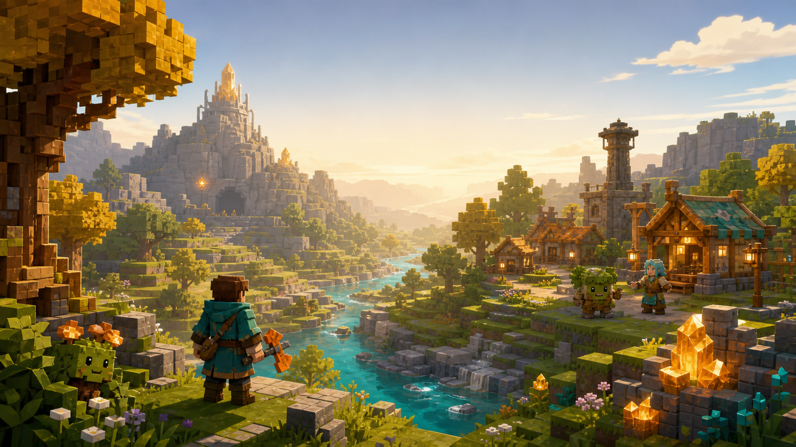
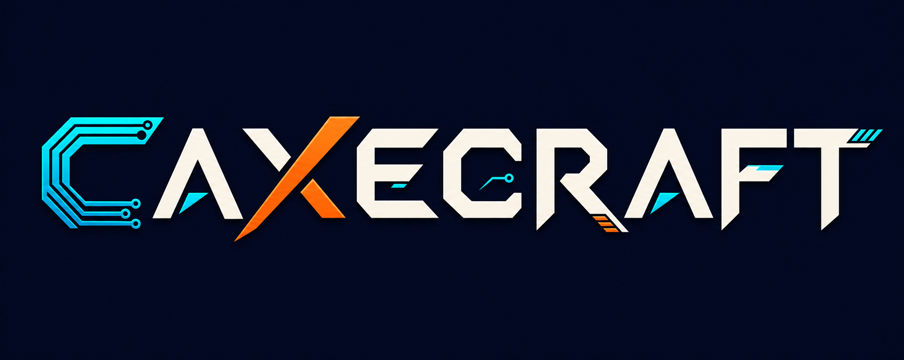
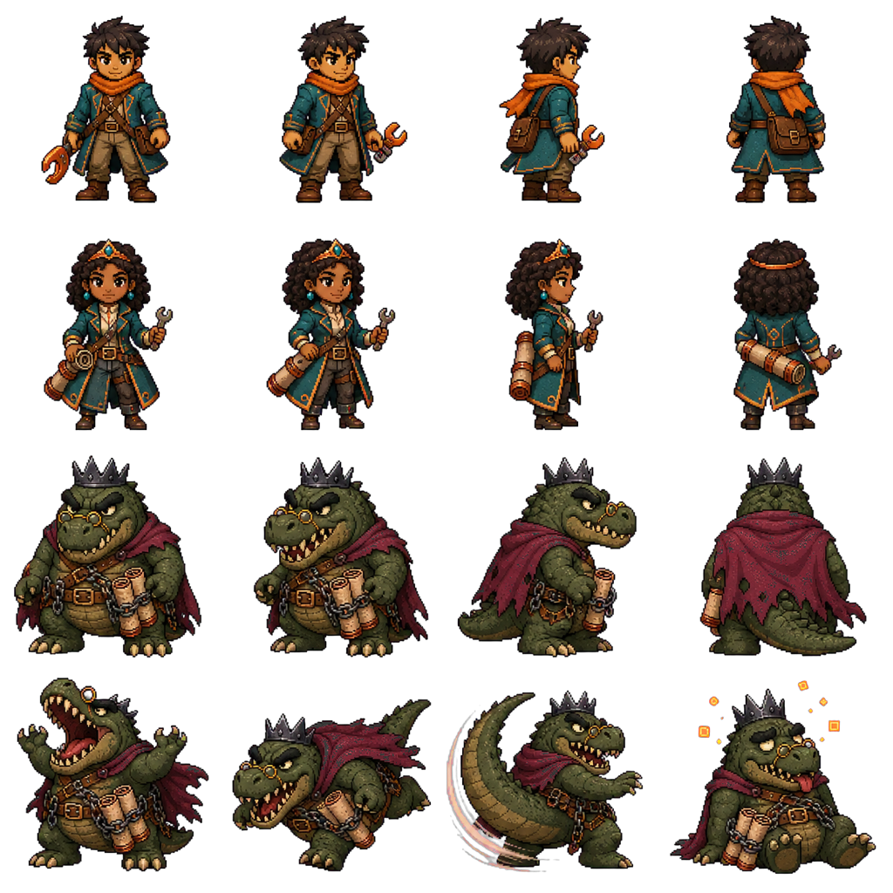
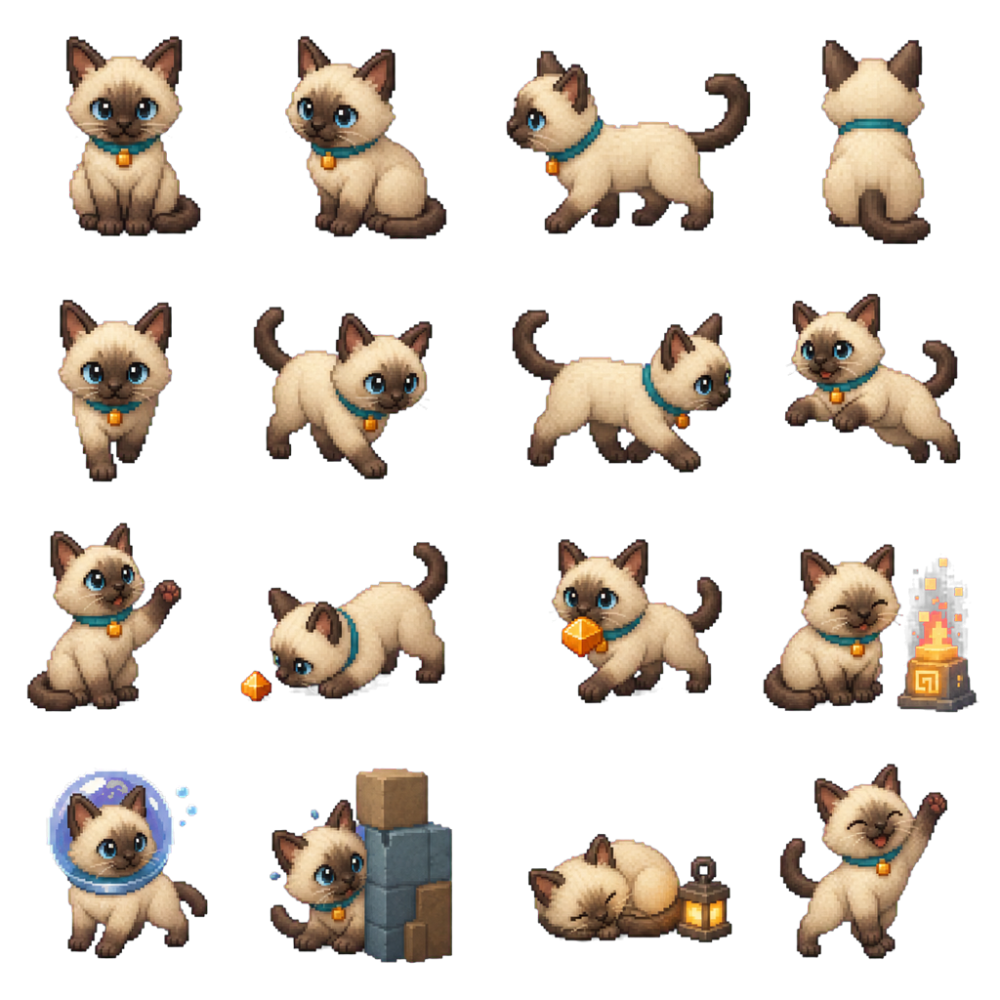

# Caxecraft game design document

Document version: 1.0-draft
Product owner: `haxe_c-xge`
Audience: players, designers, contributors, compiler engineers, and reviewers

Status: accepted product and technical direction; implementation is staged.
The deterministic domain, first original art pack, and first native Raylib
feasibility slice exist today. That slice can move, collide, jump, select,
remove, and place colored blocks; it now has the textured title, a typed
eight-slot inventory/hotbar, reviewed item/HUD art, and deterministic native
input pilots. A small authored spawn meadow now introduces Nia through a
two-step welcome/berry gift and renders one fixed-step Mossling with bounded
notice/chase/return behavior. Adventure now adds the first complete combat
exchange: three aimed Copper Sword strikes defeat that Mossling, its visible
berry drop can be collected, contact damage uses three half-step hearts, and a
selected berry restores one heart without exceeding the health limit. A fallen
player can return to the meadow. Full stacks preserve Nia's gift and any
uncollected part of a world drop instead of silently deleting items. This is
the first actor loop, not the
planned finished game. The
target-neutral editor command/history/test-play layer now exists, but the
in-game Raylib interface does not. The menu can choose Creative or Adventure;
the authored mode content does not run yet beyond that first encounter. Broader
combat and enemies, broader item recovery, NPC dialogue, persistence, complete
localization, Ivvy behavior, terrain/entity art, audio, and the authored
campaign remain unimplemented. Do not describe
concept art, semantic editor tests, or the remaining design-only atlases as
evidence that those broader capabilities run.

The durable work owners are:

- `haxe_c-xge.7`: first playable C/raylib vertical slice;
- `haxe_c-xge.15`: original visual and UX direction;
- `haxe_c-xge.17`: bounded inventory, items, creatures, and NPC loop;
- `haxe_c-xge.19`: CaxeMap format, scenario editor, and CaxeFlow rules;
- `haxe_c-xge.20`: Creative mode and the authored Adventure;
- `haxe_c-xge.21`: English and Mexican Spanish localization;
- `haxe_c-xge.22`: Ivvy companion behavior and presentation;
- `haxe_c-xge.8`: measured chunked rendering;
- `haxe_c-xge.12`: public showcase and release evidence.

## Product promise

Caxecraft should be a small, attractive voxel game and haxe.c's current
flagship product-level E2E/QA workload. It demonstrates that ordinary typed
Haxe can express readable game logic, compile through Reflaxe.C to direct,
inspectable C, and call raylib without an engine-shaped runtime hiding the
boundary. It should be enjoyable to play and useful to inspect. When it exposes
a compiler weakness, the project reduces that weakness to a focused reusable
test, fixes the owning compiler layer, and retains the game path as integrated
regression evidence; game-only compiler workarounds are not acceptable.

The primary audience is a child or family who wants to explore, build, follow
a short adventure, or create a small scenario. The secondary audience is a
programmer who wants to inspect the Haxe and generated C and understand where
the ergonomics and costs come from. Neither audience should need compiler lore
to enjoy or understand the game.

## Design pillars

1. **Warm, legible voxel adventure.** Landmarks, silhouettes, interactions,
   and objectives are readable without copying another game's presentation.
2. **Create at two depths.** Creative mode offers immediate building, while
   CaxeMap and visual CaxeFlow let a child make a small playable story and let
   an advanced author inspect the same typed data.
3. **Helpful, never punishing.** Checkpoints, journal hints, reversible
   puzzles, Ivvy, and safe recovery prevent soft locks without playing the
   game for the player.
4. **One honest implementation.** Built-in content uses the public editor and
   scenario format. The game does not hide special campaign logic or compiler
   shortcuts behind an example-only path.
5. **Show the machine.** Haxe stays readable, the generated C is intended to
   be readable and performant, and QA exposes runtime selection, ownership,
   output shape, and costs rather than concealing them.

## Core player loop

| Moment | Player verb | Immediate feedback | Longer purpose |
| --- | --- | --- | --- |
| Explore | move, look, swim, inspect | landmark, visible cue, optional spatial sound, Ivvy reaction | discover routes, materials, NPCs, and secrets |
| Gather | mine, pick up, exchange | block crack, pickup arc, hotbar count | obtain building blocks, healing, tools, and route items |
| Shape | place, remove, select | outline, placement preview, undo-safe result | build in Creative or solve spatial problems |
| Interact | talk, activate, equip | prompt, dialogue card, journal update | learn objectives, codes, mechanics, and story |
| Survive | dodge, strike, use item | telegraph, health/stamina response | clear bounded encounters and reach checkpoints |
| Create | paint, place, connect rules, test | live overlay, validation, immediate test play | author and share a finite scenario |

The target Adventure length is deliberately small: roughly 30 to 60 minutes
for a first completion, with a shorter critical path and optional exploration.
Creative and editor sessions are open-ended within explicit finite-world and
entity limits. These are design targets, not shipped performance or content
claims until their owning gates pass.

The familiar block-building vocabulary is intentional, but the identity is
original. Caxecraft must not copy Minecraft or another game's textures, mobs,
fonts, logo, screen layout, sounds, architecture, or other trade dress. The
visual language uses slate, teal, honey wood, meadow green, copper, and Haxe
orange, with asymmetric compiler circuits and split-wedge tool forms as
recurring motifs.

The name and mark encode the technical story:

- the cyan circuit-trace **C** represents readable, idiomatic C output;
- the orange diagonal **X** represents cross-target compilation;
- **craft** is both world building and careful source construction.

The current game mark contains no official Haxe glyph. A future “built with
Haxe” badge may use an unmodified official mark only after explicit brand and
redistribution review. The fictional Haxeforge instead uses an asymmetric
orange split-wedge head, graphite handle, cyan circuits, and subtle H-shaped
negative space; it must not reproduce or embellish the official four-facet
glyph.

## Modes

### Creative

Creative is the low-pressure finite sandbox. It provides free block placement
and removal, exploration, the full inventory, friendly NPCs, scenario loading,
and a direct path into Edit and Test Play. Flight, damage, resources, enemies,
and world reset are explicit settings, not undocumented debug flags.

### Adventure

Adventure is a short authored minigame with a complete beginning and ending.
It opens with a small, readable story window that can be advanced by mouse,
keyboard, or controller, skipped immediately, and replayed later.

Haxirio is a young explorer who uses the Haxeforge. Princess Ceesh is a capable
engineer-princess. Haxirio first showed her how Haxe and Caxe can produce
beautiful, efficient, idiomatic C; she quickly became a collaborator, improved
the approach with him, and the two fell in love. Their affection is warm and
understated rather than the reward for a rescue. Browser is an original, ugly,
charismatic T-rex-like tyrant who wants the realm to carve repetitive and
unsafe C by hand. The joke is affectionate toward C: Browser represents
needless boilerplate and unsafe repetition, not the language or C programmers.
Ceesh remains an active character in the resolution rather than a passive
prize.

The opening prose stays concise. The exact final copy is owned by UX review,
but it should communicate this shape:

> Browser has seized Ceesh and the Forge Archive, forcing every craftsperson to
> write the old boilerplate by hand. Haxirio follows the river toward the
> castle with the Haxeforge and the better idea they discovered together:
> express intent clearly in Haxe, then let Caxe shape careful C.

### Cast and emotional roles

| Character | Game role | Personality and readability | Mechanical contract |
| --- | --- | --- | --- |
| Haxirio | player hero | curious, capable, kind; teal coat and Haxeforge silhouette | every required action is player-controlled; no fixed gendered voice is needed |
| Ivvy | Siamese-cat companion | affectionate, alert, a little mischievous; dark mask, ears, paws, and tail | follows or stays, helps within limits, never dies or becomes a fail condition |
| Ceesh | engineer-princess and collaborator | clever, active, warm, visually associated with copper and the Forge Archive | participates in the resolution and teaches or operates part of the finale |
| Fallskeeper | western clue NPC | patient and memorable beside the falls | repeats the four-glyph clue and ensures it enters the journal |
| Moss and Nia | friendly world NPCs | grounded guides rather than exposition machines | introduce exploration, building, inventory, and exchanges in small steps |
| Browser | final boss | theatrical, ugly T-rex-like tyrant; original silhouette | telegraphed deterministic phases and a non-soft-locking defeat sequence |

Ivvy is inspired by the player's real Siamese family cat, using the private
photo only as a generation reference. Repository evidence proves the photo and
its path are not copied into or distributed from this repository. The stylized
Ivvy atlas is original Caxecraft art and the manifest retains only a
non-identifying reference description.

Ivvy remains a companion rather than an automation system:

- **Follow / stay:** a simple interaction controls positioning; Ivvy avoids
  the crosshair, build target, doors, and narrow traversal space.
- **Catch up safely:** local steering and last-safe-position recovery handle
  ordinary obstacles. A deterministic visual catch-up is allowed only after a
  declared distance or stuck-time limit.
- **Point and warn:** Ivvy can face, paw, or call attention to a nearby secret,
  the suit trail, or an approaching enemy, but never reveals the vault code,
  solves the bridge, completes an objective, or attacks the boss for Haxirio.
- **Retrieve and comfort:** eligible small drops may be returned within a
  bounded range. A checkpoint purr restores a modest declared amount and
  cannot be farmed outside its cooldown/state rule.
- **Water safety:** the Tideweave sequence gives Ivvy a visible bubble collar.
  Ivvy follows admitted safe underwater routes or waits and reunites safely;
  the companion cannot drown or strand progression.
- **No harm loop:** hostile targeting and damage exclude Ivvy. Hazards cause
  cover, retreat, or recovery, never death, injury spectacle, lost quest items,
  or a child-facing failure caused by the pet.

The renderer-independent companion state is closed and inspectable: Follow,
Stay, CatchUp, PointSecret, Warn, Retrieve, Purr, Swim, Cover, and Sleep are
the initial design vocabulary. Exact variants may be revised before
implementation, but behavior must remain bounded, deterministic, serializable,
and covered by C-versus-Eval traces.

### Player systems and bounded content

| System | First complete scope | Explicit first-version limit |
| --- | --- | --- |
| Movement | first-person walk, step, jump, swim, collision, safe respawn | no vehicles, mounts, climbing system, or physics sandbox |
| Building | pick, remove, place, selection preview, finite world bounds | no infinite terrain, automation machines, or multiplayer edits |
| Inventory | eight-slot hotbar, bounded backpack, stackable blocks/items, clear full state | no large crafting tree or arbitrary item scripting |
| Tools | Haxeforge mining, combat, and interaction forms | no durability grind or dozens of weapon tiers |
| Survival | health, bounded stamina/air where relevant, consumable recovery, checkpoints | no hunger treadmill unless playtesting proves it improves the short campaign |
| Enemies | Mossling, Ember Wisp, biome-justified additions, Browser | no unbounded spawn ecology or general pathfinding engine |
| NPCs | concise dialogue, hint, exchange, objective, and journal updates | no procedural dialogue or opaque reputation simulation |
| Powerups | Bounds Ward, Inlining Spark, Zero-Cost Charm, Cleanup Crest | effects are obvious and temporary or explicitly persisted |
| Companion | Ivvy follow/stay, help cues, retrieval, purr, underwater safety | no pet combat, death, breeding, or maintenance burden |

## Authored route

The map is compact enough to learn, but landmarks reveal two meaningful ways
to reach Browser's castle:

```text
Evergrove start and house
        |
        +--> western falls --> Fallskeeper clue --> hidden suit vault
        |                                          |
        |                                  Tideweave Suit
        |                                          |
        |                                  flooded ruins/tunnel --+
        |                                                          |
        +--> Frostmere snow shelf --> Ashfall bridge puzzle --------+--> castle
                                                                        |
                                                                 Browser boss
```

The exact route order may bend spatially, but these gameplay contracts do not:

- Forest, water, underwater ruins, snow, ash, the house, bridge machinery,
  castle exterior, courtyard, and boss room are distinct readable spaces.
- The player may discover both blocked approaches before choosing one.
- The western Fallskeeper repeats a four-glyph suit-vault clue. The quest
  journal records it; progression never tests the player's memory or hearing.
- The Tideweave Suit is hidden elsewhere. It adds a bounded air reserve,
  swimming control, underwater mining, and cold-water protection. Without it,
  the submerged tunnel remains visibly unsafe but recoverable.
- The bridge route is independently completable and deliberately harder. Its
  signal/evaluation-order puzzle has reset, partial, hint, solved, and
  enemy-interruption states; it is not a guessing lock.
- Either route reaches the castle. Completing both can award a bounded secret
  or powerup but never blocks the ending.
- Checkpoints precede costly challenges, and death cannot strand quest items,
  corrupt rule state, or soft-lock the map.

The bounded combat catalog begins with Mosslings and Ember Wisps, then adds
only enemies justified by a biome or encounter. Browser has telegraphed,
deterministic phases: roar/space control, charge, tail sweep, a vulnerable
stun, and an ending that cannot leave the arena locked. Powerups use compiler-
themed names such as Bounds Ward, Inlining Spark, Zero-Cost Charm, and Cleanup
Crest, but each has an obvious game effect without requiring compiler lore.

## One public authoring path

The shipped Creative defaults and Adventure are data authored with the same
editor and format available to players. Haxe source may implement reusable
game mechanics, but it must not contain a privileged copy of the campaign's
geometry, placement, dialogue, objectives, gates, or encounter graph.

### CaxeMap

`.caxemap` is a versioned, deterministic, scalar-UTF-8 text format. The first
version is deliberately line-oriented and typed rather than general JSON or a
serialized dynamic object graph. This keeps it human-diffable, permits a small
validated parser, and avoids making `Dynamic` the scenario model.

The exact version-1 grammar, bounds, canonical ordering, CaxeFlow vocabulary,
execution boundaries, recovery rules, and first review fixture are published
in the [CAXEMAP 1 reference](caxemap-1.md). The broad editor feature is split
into `haxe_c-xge.19.1` through `.19.6`, so the format/model, codec, rule engine,
native persistence, editor semantics, and child-friendly Raylib UI each have a
separate acceptance boundary.

A scenario contains:

- format version, logical asset pack, title, and bounded world dimensions;
- a typed block palette and z/y/x-ordered RLE voxel chunks;
- stable object IDs plus author-facing tags;
- typed prefab, entity, item, NPC, spawn, checkpoint, and trigger placements;
- dialogue, journal entries, objectives, routes, and mode settings;
- CaxeFlow state declarations, rules, and reusable action sequences.

The canonical writer uses one ordering and escaping policy, writes no absolute
paths or timestamps, and saves to a sibling temporary file before an atomic
replace. Loading validates the complete scenario before it can replace a
known-good world. Unknown required features, malformed UTF-8, invalid runs,
duplicate IDs, unresolved references, and impossible placements fail with
actionable diagnostics.

### CaxeFlow: simplest system powerful enough

CaxeFlow is not a Build-sector clone, Minecraft command-block clone, or
embedded Luanti/Lua runtime. It borrows the useful ideas visible in modern
voxel authoring systems—events, composable predicates, ordered actions,
scoped state, reusable behavior, and developer extensions—then gives them one
small typed and deterministic model.

The fundamental rule is:

```text
WHEN <event>
IF   <predicate>       # optional, composable with all/any/not
DO   <action>
DO   <action>          # ordered
```

The admitted first-version events cover entering/leaving a zone, interaction,
block change, item use, entity defeat, signal receipt, timer expiry, objective
change, and fixed-tick state change. Predicates cover typed flags/counters,
entity or object state, inventory, quest state, proximity, mode, and bounded
comparisons. Actions cover state updates, dialogue/journal, give/take,
spawn/despawn, door/bridge/object state, checkpoint/objective changes, effects,
fixed-tick scheduling, named sequence calls, and deferred signals.

Rules evaluate against a defined fixed-tick state. Their action list retains
source order. Cross-rule signals and scheduled work enter a deferred queue, so
there is no same-stack re-entrant cascade. Rules run by explicit priority and
then stable ID. Calls, events, scheduled actions, spawned entities, and nested
predicate depth have hard budgets. Exhausting a budget produces a visible
scenario diagnostic instead of a hang or silent truncation. Seeded choices are
explicit; unseeded randomness and wall-clock timing are not part of scenario
semantics.

### Child-friendly visual rules

The default editor is intended to be usable by a curious seven- or eight-year-
old with basic reading ability:

1. select a zone, switch, NPC, enemy, door, or other object in the world;
2. choose **Add rule**;
3. fill large icon-backed sentence cards such as
   **When player enters this area -> say this -> open that door**;
4. pick referenced objects in the world rather than typing IDs;
5. press **Test** and see the result immediately;
6. undo safely or follow a plain-language validation message.

Templates cover a door and key, treasure hunt, NPC conversation, checkpoint,
enemy wave, bridge switch, and simple win condition. A world overlay draws
event/signal relationships and highlights broken references. Text and icons
coexist for accessibility; important state does not depend on color alone.

An **Advanced** disclosure expands the same rule—not a second toy format—to
show nested predicates, typed local/map/player/quest variables, fixed-tick
delays, reusable parameterized action sequences, signals, and seeded choices.
Developer-defined mechanics are ordinary typed Haxe conditions/actions
registered at compile time. Version 1 maps never embed arbitrary Lua, native
code, shell commands, or downloaded scripts, which keeps shared child-created
content substantially safer and keeps C emission inspectable.

The editor itself supports bounded paint/erase/fill, selection, prefab stamps,
entity and trigger placement, dialogue/objective editing, undo/redo, validation,
save/load, and reversible Edit <-> Test Play transitions. The Adventure must
round-trip through this public path with byte and semantic parity.

The renderer-independent part of that contract is now executable: closed
commands, bounded exact undo/redo, last-playable recovery, in-memory canonical
reload, and disposable CaxeFlow test play are documented in
[Caxecraft editor semantics](caxecraft-editor.md). Native file save/load and the
child-friendly Raylib presentation remain separate gates; the Eval proof must
not be described as a shipped visual editor.

## Music, sound, and audio authoring

Caxecraft uses a small original audio identity rather than imitating another
voxel game's melodies or effects. The first cue sheet covers menu/title,
Evergrove exploration, the falls and submerged Tideweave route, Frostmere,
Ashfall/castle tension, Browser's boss encounter, and victory. Short effects
cover UI focus/confirm/cancel, footsteps by broad material family, block
remove/place, pickup and inventory feedback, water, damage and combat,
checkpoint recovery, bridge/suit mechanisms, enemies, and Ivvy's helpful
reactions. The final list stays bounded and each cue has a stated gameplay
purpose.

MIDI is an editable composition source, not the shipped playback format.
Raylib 6.0 streams WAV, QOA, OGG, MP3, FLAC, XM, and MOD, but does not provide a
MIDI synthesizer. Caxecraft therefore keeps type-1 MIDI and a pinned composition
or synthesis recipe where useful, exports looped music to Ogg Vorbis, and uses
short lossless PCM WAV files for effects. Every source, instrument or synthesis
recipe, offline render tool/version, loop point, export setting, license, and
output hash is recorded. A clean build never calls an online music service.

Shared gameplay emits typed requests using stable content IDs; it does not
load files or own a native audio handle. CaxeFlow's shipped `PlayEffect` action
already produces a target-neutral `EffectRequested` value in deterministic
action order. No sound is loaded or played by that semantic step. The future
Raylib adapter will resolve the ID, stream music, limit simultaneous effects,
apply master/music/effects/ambience volumes, and release every resource.
CaxeMap asset packs will map audio IDs to logical files. Music selection,
stopping, restart, fade, and missing-asset behavior remain unadmitted until
their exact semantics are specified. Scenario rules never contain host paths.

The editor will select and preview registered cues, stop preview immediately,
author simple region music and trigger-driven effects, and validate missing or
wrong-kind IDs. Essential information always has a visible cue or optional
caption; puzzles, Ivvy hints, danger warnings, and objectives never depend on
hearing alone. Settings and captions support English and es-MX, while stored
audio identity remains language-neutral.

This is planned work under `haxe_c-bf3`. The current locked RaylibHx core
deliberately omitted resource-owning audio APIs, and CAXEMAP currently carries
only the semantic effect ID—not audio files, buses, music policy, or native
resources. The audio issue owns that binding extension, the original
source/runtime assets, typed game adapter, language/editor surface, packaging,
native QA, and generated-C inspection.

## UX, accessibility, and localization

The main menu exposes **Adventure**, **Creative**, **Editor**, **Settings**,
and **Quit** without hiding the editor behind a developer flag. The first-run
flow asks for language before story text and then teaches only movement, look,
interaction, and pause. Other mechanics arrive in context. Keyboard/mouse and
controller actions use the same semantic input names so prompts can switch
without changing gameplay state.

Every modal or overlay has a clear close/continue action, focus order, pause
behavior, and controller equivalent. Story and dialogue never auto-advance;
the opening is immediately skippable and replayable. Objectives appear in a
compact journal, the latest important clue remains recoverable, and puzzle
hints never depend only on color, sound, memory, or English wordplay. Crosshair,
selection outline, damage, low air, interaction, and focus state each have a
shape or motion cue in addition to color.

English (`en`) and Mexican Spanish (`es-MX`) are equal launch languages for
all built-in content:

- menu, settings, controls, pause, save/load, errors, credits, and help;
- Adventure story, dialogue, objectives, journal, item/powerup descriptions,
  boss feedback, and Ivvy prompts/status;
- Creative options and all editor/CaxeFlow cards, templates, validation, and
  the five-minute first-map tutorial.

Player-visible text uses stable typed message IDs and whole localized
templates with typed named placeholders. Gameplay rules, object IDs, tags,
saves, and trigger identity stay language-neutral. Required text is never
baked into bitmap art. The font path must cover scalar-UTF-8 Spanish glyphs,
including `á é í ó ú ü ñ Ñ ¿ ¡`, at every admitted UI scale. Layout snapshots
exercise both languages, long strings, wrapping, input prompts, and small and
large viewports. A native Spanish speaker and a child-oriented usability pass
review the final copy before showcase closure.

## Saves, recovery, and user content

Creative worlds, Adventure progress, editor drafts, and exported scenarios are
distinct typed records with explicit versions. A save records stable IDs and
state, never translated display strings, absolute paths, wall-clock-derived
ordering, or raw process data. The game validates a complete load before it
replaces live state and writes through a temporary sibling plus atomic replace
where the platform supports it.

Adventure saves preserve the active checkpoint, objectives, journal clues,
route/puzzle state, inventory, equipped suit, Ivvy state, and boss progression
needed for exact recovery. Quest-critical items cannot be dropped, consumed by
Ivvy, lost on death, or duplicated across a retry. Editor test play operates on
a reversible snapshot: stopping the test returns to the draft unless the user
explicitly imports a supported change.

The storage roles are deliberately separate:

- An authored `.caxemap` contains the designed finite world, placements,
  dialogue, objectives, and CaxeFlow rules. The editor saves this format.
- A live game save refers to its source map and stores only the complete typed
  state needed to resume play, including changed blocks, player state,
  inventory, objects and characters, objectives, variables, timers, and the
  deterministic choice state.
- Editor test play uses a temporary in-memory snapshot. It does not silently
  turn play-time changes into edits.

The target-neutral map codec exists, but native map-file writes remain owned by
`haxe_c-xge.19.4`. The live world/save-game model and codec are owned by
`haxe_c-4my`; they are not implemented yet. The save format's public filename
extension will be chosen with that codec rather than guessed in advance.

User scenarios are local, finite, data-only `.caxemap` files in version 1.
Sharing a map does not grant shell, native-code, arbitrary Lua, network, or
filesystem authority. Loading still treats authored text and references as
untrusted input and reports bounded, localized diagnostics.

## Why Haxe is the reusable layer

The informal pitch is that Haxe feels like a "superpowered TypeScript": its
syntax and static types are approachable to many TypeScript developers, while
abstracts, exhaustive algebraic data types, macros, conditional compilation,
multiple established targets, and compiler extensibility can shape very
different outputs. Caxecraft should make that advantage concrete without
turning the slogan into a false claim that every target works automatically.

The source itself is part of that proof. A TypeScript developer should be able
to open the game and recognize modules, records, arrays, functions, and familiar
control flow, then see Haxe add useful nominal abstracts, closed enums, and
exhaustive pattern matching where they prevent mistakes. Prefer small cohesive
readers and domain operations over framework-style boilerplate, numeric type
tags, giant controllers, or C-shaped procedural code. Target-specific storage,
ownership, and ABI details belong behind narrow typed adapters with a plain-
language reason. This standard applies to tools and codecs as well as gameplay;
passing Eval or generating C is not enough if the Haxe is unpleasant to learn
from.

Shared Haxe owns gameplay, CaxeMap/CaxeFlow, quests, editor semantics, and
deterministic traces. Narrow adapters own:

- storage and allocation representation;
- filesystem and user-content locations;
- fixed clock and input collection;
- rendering, audio, and window lifecycle;
- native resources, build, and packaging.

The authoritative first implementation is C plus raylib. A JavaScript/browser,
WebAssembly, Rust, or Go experiment may reuse most typed source and tests while
replacing those adapters. WebAssembly might come through a C toolchain or a
different Haxe backend; that is an experiment, not a current platform claim.
No universal Reflaxe IR or lowest-common-denominator renderer is required.
Observable Haxe behavior and differential traces are the shared contract.

The explicit boundaries, closed variants, limited target conditionals, typed
scenario schema, and semantic tests should also reduce the surface that a human
or an LLM must understand during a port. A capable LLM may translate a small
adapter and repair target-specific edges with fewer tokens than a from-scratch
rewrite; a smaller model or manual porter should benefit from the same local
structure. This remains a hypothesis until measured. A later port study records
changed lines, adapter size, reused source/tests, model and token usage when an
LLM is used, human review time, target-specific defects, runtime/code size, and
semantic trace parity. Do not publish "fewer tokens" or "easy portability" as
a result before that evidence exists.

The narrower `#if c` representation seam and longer cross-target sequence are
specified in [the deterministic domain design](caxecraft-domain.md).

## Visual assets and Haxe identity

The checked-in first art pack lives under `examples/caxecraft/assets/`. Its
machine-readable inventory, grid coordinates, hashes, source/generation IDs,
processing history, and license notes live in that directory. The pack covers:

- base and Adventure terrain materials;
- inventory, suit, powerup, quest, and puzzle icons;
- two friendly NPCs, two ordinary enemies, Haxirio, Ceesh, Browser, and Ivvy;
- HUD states, the C/Haxe-aware engineering wordmark, and title panorama.

These are original Caxecraft primary source assets. They deliberately avoid
existing game marks and characters, and the current pack contains no official
Haxe logo binary. The exact selected PNGs are pinned and offline; online image
generation is never a clean-build dependency. The registered validator checks
their hashes, semantic atlas order, complete file inventory, and minimal PNG
metadata. The title panorama, wordmark, HUD, and item atlas are now packaged as
their exact verified primary bytes and owned by one explicit texture adapter;
the game has native title and hotbar screenshots, but not pinned
software-render goldens. Before `haxe_c-xge.15` closes, any derived runtime
assets need a deterministic conversion pipeline, and the complete visual pass
still needs filtering/lifetime review, software-render goldens, real-renderer
screenshots, Git/LFS growth policy, and human visual review. The Haxeforge
atlas is intentionally deferred until its original asymmetric design passes
the same review.

### Visual reference board

These pinned design sources establish the intended warmth, palette, silhouettes,
and C/Haxe identity. They are not renderer screenshots.









## QA and compiler value

Every layer contributes executable compiler evidence:

- fixed-step terrain, physics, inventory, AI, combat, quests, boss phases, and
  CaxeFlow use closed types and large structured control flow;
- CaxeMap exercises scalar UTF-8, bounded parsing, collections, filesystem I/O,
  deterministic serialization, validation, and failure cleanup;
- editor and HUD exercise direct raylib calls, resource ownership, input,
  clipping, responsive layout, and stateful UI without a hidden engine;
- split generated C snapshots should mirror Haxe modules and retain structured,
  readable control flow rather than a literal label/goto dump;
- Eval and generated C compare exact semantic traces independent of pixels;
- the pinned software renderer owns exact screenshot goldens, while real GPU
  runs provide reviewed screenshots without pretending cross-GPU bytes match;
- GCC/Clang, O0/O2, sanitizers, deterministic rebuilds, scenario round-trips,
  malformed inputs, resource cleanup, frame/update time, draw calls,
  allocations, generated size, binary size, and selected `hxrt` features are
  explicit gates.

### Code-quality flywheel

Caxecraft is allowed to expose compiler limitations; it is not allowed to hide
them. Application and editor code use small cohesive modules, closed enums and
records, exhaustive switches, explicit bounds and ownership, fixed-step state,
and renderer-independent semantic tests. Target-specific code is isolated in
narrow platform adapters. Repeated `#if c` branches, dynamic bags, raw C,
string-built foreign calls, unchecked casts, or game-specific compiler name
checks are architecture failures, not acceptable showcase shortcuts.

When the game finds a compiler gap:

1. reduce it to the smallest ordinary-Haxe reproducer;
2. create or update a general compiler/runtime/stdlib owner;
3. add a focused semantic, generated-shape, negative, or native fixture there;
4. implement the general fix with no Caxecraft-specific branch;
5. retain the game path as end-to-end regression evidence;
6. inspect the generated C for structure, names, runtime selection, warnings,
   allocations, and performance before calling the result showcase-quality.

The generated C goal is stronger than native compilation: split mode should
make source ownership recognizable, control flow should use structured C where
semantics allow it, temporary names should be concise and stable, and the
result should be usable by a C programmer as a maintained handoff. Unity mode
remains available for embedding, debugging, or distribution needs. The current
domain corpus now has structured reducible control flow, source-shaped ordinary
names, conservative temporary coalescing, exact split/package/unity snapshots,
and a [schema-validated maintainability
report](generated-c-maintainability.md).
Those fixed-corpus gates prevent silent regression, but declaration cleanup and
broad arbitrary-program handoff evidence remain separate; this slice alone is
not a universal C-programmer handoff claim.

The implementation sequence is the completed first feasibility slice and
RaylibHx core, followed by visual integration, inventory/entities, CaxeMap plus
editor/CaxeFlow, authored Adventure, measured rendering, and finally
public-showcase evidence. Art and design can develop earlier, but no
documentation may collapse the first slice into "finished" or
"showcase-ready."

## Second phase: local two-player creation

Local two-player split screen is intentionally scheduled after the complete
single-player showcase milestone. It must not delay the first honest Creative,
Adventure, editor, localization, and compiler-QA release. The durable owner is
`haxe_c-xge.28`.

That phase should open a general creation space instead of bolting one co-op
campaign onto the game. CaxeMap and CaxeFlow will gain the smallest closed
concepts needed to address a player or team, share or separate state, assign
spawn/checkpoint groups, and express cooperative, race, and versus completion
rules. Creators should then be able to make asymmetric puzzle adventures in
the spirit of two-person co-op games, races, or small arenas without editing
Haxe source or embedding an unrestricted scripting language. Existing
single-player maps must keep working unchanged.

Controllers are part of the product contract, not an optional polish pass.
The two-player phase includes clear device assignment, two common gamepads,
documented keyboard fallback, hot-plug/reconnect behavior, pause/focus rules,
and English/Spanish prompts. Both viewports render one deterministic world
simulation, while headless tests cover input ordering plus shared and
per-player state. Online multiplayer is separate research: split screen does
not silently commit the format to networking, rollback, or matchmaking.

## Definition of the first showcase release

The first showcase release is reached only when all of the following are true:

- a clean checkout can build and launch the pinned raylib application through
  the documented developer command on every platform explicitly claimed;
- Adventure has a complete start, both route solutions, boss, resolution,
  saves/retries, bilingual copy, and Ivvy behavior with no known soft lock;
- Creative and the editor can create, validate, save, reload, and test a small
  scenario, and the shipped content round-trips through the same path;
- input, focus, pause, resize, controller, child-readable Spanish/English UI,
  and accessibility states have recorded human review;
- generated C snapshots, semantic traces, native e2e, real-raylib integration,
  deterministic software-render goldens, strict GCC/Clang, sanitizers,
  packaging, and resource cleanup all pass;
- frame/update time, draw calls, allocations, runtime features, generated C
  size, binary size, and representative hand-written-C comparisons are
  measured and reported without unsupported marketing claims;
- every bitmap/font/native dependency has offline bytes, hashes, provenance,
  license/brand handling, and an explicit runtime lifetime.

Until then, individual assets, deterministic domain traces, the current
feasibility executable, or compiler fixtures are evidence for their bounded
slices only—not evidence that the complete designed game is finished.
